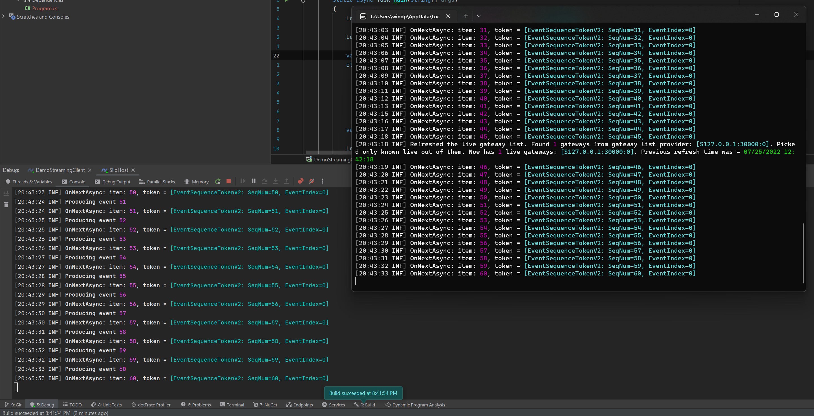

# Microsoft Orleans Streaming Demo

This project demonstrate how to use [Microsoft Orleans Streams](https://docs.microsoft.com/en-us/dotnet/orleans/streaming/).

You need to run [Azurite v3+](https://github.com/Azure/Azurite) Azure storage emulator to provide Orleans storage & stream provider.

First run `src/SiloHost` project to start silo, then you can either run `src/DemoClient`(Call RPC of producer grain to start streaming) or `src/DemoStreamingClient`(Use StreamProvider to access stream on RPC client) project to initiate streaming demo

Below is the screen shot of running `src/DemoStreamingClient`project:

